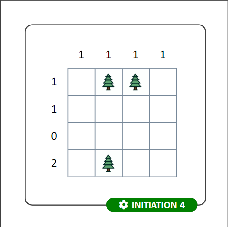
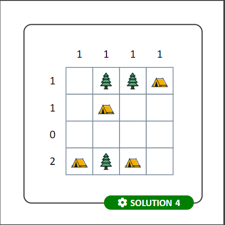

# Tents and Trees - Version imprimable (en LaTeX)

## Aperçu du projet

Ce projet a pour ambition de permettre aux amateurs de casse-tête de générer des livrets imprimables de Tents & Trees. 
<tr>

<td>  </td>
<td>  </td>
</tr>

Le code permet d'adapter la taille de la grille (initiation 4x4, débutant 6x6, confirmé 8x8 et expert 10x10).

Une version compilée est disponible dans le dossier `livret` : 

## Compilation

Les fichiers `classe-tex3R.cls`, `style-tex3R.sty`, `tnt-tex3R.sty` et `flashcards-tex3R.sty` sont des fichiers de configuration personnels adaptés du projet tex3R pour l'occasion : [https://github.com/Tex3rivieres/TeX3R-ClasseStyle/releases](https://github.com/Tex3rivieres/TeX3R-ClasseStyle/releases)

Le fichier `TnT.lua` contient le code nécesaire pour générer algorithmiquement les grilles de Tent & Trees.

Les fichiers .tex doivent être compilés en LuaLaTeX. 

## Crédits et licences

- Auteur Vincent Crombez
- Licence MIT
- Images générées par IA (Copilot Designer - 18/02/2024) et retouchées